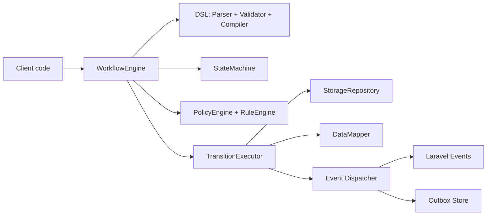
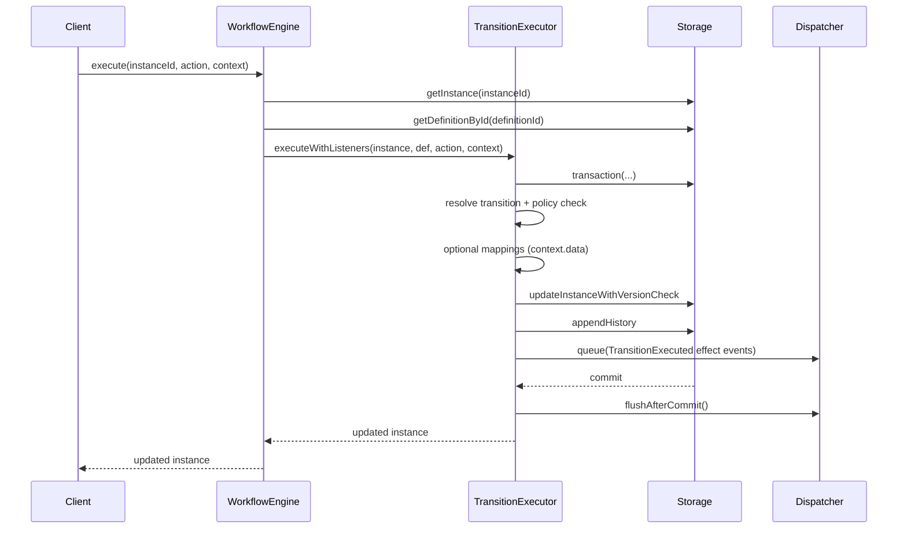
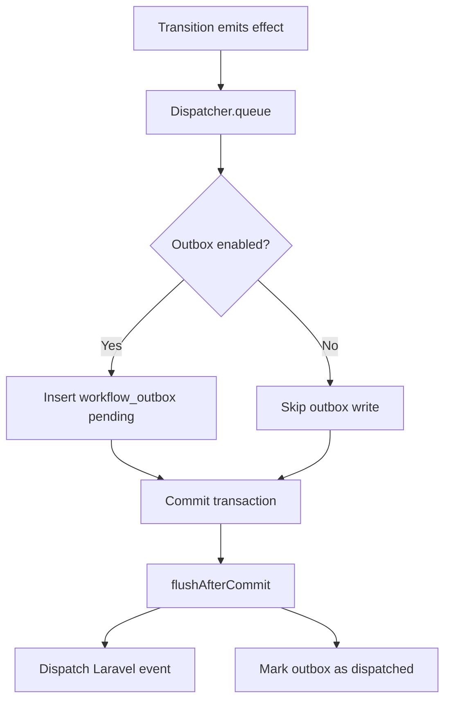
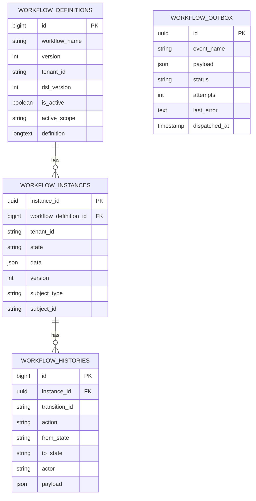

# Architecture

This document explains how the engine works today, based on the current implementation.

Goal: be simple enough for first-time contributors while still precise for maintainers.

## 1. Big Picture

Think of this package as a traffic controller for state changes:

1. A workflow definition says what transitions are allowed.
2. An instance stores current state and data.
3. `execute()` tries one action.
4. Rules/policies decide if action is allowed now.
5. If allowed, state changes in a transaction.
6. History and events are recorded.

## 2. Public API Surface

Primary API methods (stable contract):

- `start(workflowName, options)`
- `can(instanceId, action, context)`
- `canUpdate(instanceId, context)`
- `execute(instanceId, action, context)`
- `update(instanceId, context)`
- `visibleFields(instanceId, context)`

Also available:

- `availableActions(instanceId, context)`
- `history(instanceId)`
- `resolveMappedData(instanceId, action, context, options)`
- `activateDefinition(workflowName, definition, tenantId?)`
- `execution(instanceId?)` for execution-scoped hooks/listeners

## 3. Layer Responsibilities

- DSL layer (`Parser`, `Validator`, `Compiler`): reads DSL, validates constraints, creates `transition_index`.
- Rules layer (`RuleEngine`, `ContextValidator`): evaluates `role`, `fn`, `all`, `any`, `not` safely.
- Policies layer (`PolicyEngine`): applies `allowed_if` per transition and `permissions.update.allowed_if` per state.
- Fields layer (`FieldEngine`): computes `visible` and `editable` field lists with rule guards, including state-level editable projection for in-state updates.
- Engine layer (`WorkflowEngine`, `StateMachine`, `TransitionExecutor`, `ExecutionBuilder`): orchestration and lifecycle.
- DataMapping layer (`DataMapper`): input write mapping and read-time resolution.
- Functions layer (`FunctionRegistry`): whitelist for callable functions used by rules.
- Events layer (`Dispatcher`): queue + flush semantics, optional outbox persistence.
- Storage layer (`DatabaseWorkflowRepository`, `InMemoryWorkflowRepository`): definitions, instances, history, transactions.

## 4. Definition Lifecycle

When `activateDefinition()` is called:

1. Parse DSL (`Parser`).
2. Validate required keys and deterministic constraints (`Validator`).
3. Compile transitions index (`Compiler`).
4. Persist as active definition in storage.
5. Invalidate old active cache pointer for same scope.
6. Warm local/distributed cache with new active definition.

Validation rules currently enforced include:

- Required keys: `dsl_version`, `name`, `version`, `initial_state`, `states`, `transitions`.
- `initial_state` must exist in `states`.
- `final_states` must be non-empty and members of `states`.
- Each transition requires non-empty `from`, `to`, `action`, `transition_id`.
- Transition `from`/`to` must exist in `states`.
- `from + action` must be unique.
- Rule `fn` names must exist in `FunctionRegistry`.
- Mapping configs are validated by type and required keys.
- Transition-level `validation.required` is validated as an array of non-empty string field names.

## 5. Execution Flow (`execute`)

If anything fails inside transition execution:

- Event queue is cleared.
- A `TransitionFailed` event is queued and flushed.
- Diagnostics event `transition.failed` is emitted.
- Original exception is rethrown.

## 6. Consistency and Concurrency

Consistency model implemented today:

- Transition side effects run inside repository transaction.
- Optimistic locking via `version` in `updateInstanceWithVersionCheck`.
- Definition version immutability per `(workflow_name, version, tenant_id)`.
- Active definition uniqueness by scope (`active_scope` unique index).
- History append happens in same transaction as state mutation.
- In-state updates (`update`) follow the same transaction + optimistic-lock strategy.

Why this matters:

- Prevents silent lost updates.
- Keeps state/history aligned.
- Avoids two active definitions in same scope.

## 7. Subject Association and Guard

Instances can include:

- `subject_type`
- `subject_id`

`SubjectNormalizer` ensures canonical values.

Optional safety mode: `enforce_one_active_per_subject`.

- When enabled, `start()` checks there is no active non-final instance for same subject/workflow/tenant.
- Check and create are wrapped in transaction.
- Unique-constraint race is translated to domain exception (`ActiveSubjectInstanceExistsException`).

## 8. Rule Evaluation Model

Supported rule operators:

- `role`: checks membership in `context.roles`.
- `fn`: executes registered function from `FunctionRegistry`.
- `all`: logical AND.
- `any`: logical OR.
- `not`: logical NOT.

Important behavior:

- Missing required context for role checks throws `ContextValidationException`.
- `can()` catches rule/policy exceptions and returns `false` (safe answer, no mutation).

Functions are resolved from `FunctionRegistry` and must be registered before DSL validation/activation.

## 9. Fields Visibility/Editability

`visibleFields()` returns action-keyed field permissions from current state transitions.

- Uses `FieldEngine`.
- Supports static lists: `visible`, `editable`.
- Supports conditional gates: `visible_if`, `editable_if`.
- Final states return empty result.

For in-state updates:

- `canUpdate()` and `update()` evaluate state-level editable fields.
- Both transition-style field config (`editable`, `editable_if`) and per-field config (`field_name.editable`, `field_name.editable_if`) are supported.

## 9.1 In-State Update Flow (`update`)

`update()` is a state-preserving mutation path:

1. Load instance and compiled definition.
2. Resolve current state config.
3. Evaluate `permissions.update` authorization.
4. Validate/update only editable fields.
5. Apply state mappings when configured.
6. Persist instance data with optimistic lock (`version += 1`).
7. Append history entry with `action=update` and unchanged state.
8. Queue `updated` event and flush after commit.

## 10. Data Mapping Model

Write path during `execute()`:

- Mapping is applied only if transition has `mappings`.
- Requires `context.data` as array.
- `DataMapper::map()` updates instance snapshot and returns mapping summary.
- Before state mutation, transition required-field validation is enforced using merged `instance.data + context.data`.

Read path via `resolveMappedData()`:

- Resolves transition first by `current_state + action`.
- Fallback to latest history item with same `action` and `transition_id`.
- Final fallback only if action maps to a unique transition in definition.
- `DataMapper::resolve()` returns expanded data for mapped fields.

Mapping types:

- `attribute`: value stored directly in instance data.
- `attach`: stores references; can optionally resolve via query handler.
- `relation`: delegates persistence/query to binding handlers and supports `mode` with minimal semantics (`persist`, `reference_only`).
- `custom`: delegates to custom handler class (valid class name required by DSL validation).

V2 mapping constraints:

- `mode` is allowed only for `relation`.
- `attach` and `relation` require `target`.
- `attribute` and `custom` reject `target`.
- Invalid mapping mode fails fast unless mapping fail-silent mode is enabled.

## 11. Event and Outbox Delivery

Event dispatcher behavior:

1. `queue(event)` stores event in memory queue.
2. If outbox enabled, payload is also written to outbox table.
3. `flushAfterCommit()` dispatches Laravel events and marks outbox record as dispatched.

Replay path:

- `OutboxProcessor::processPending(limit, maxAttempts)` fetches pending/failed rows.
- Dispatches each event.
- Marks row `dispatched` or `failed` with bounded retries.

## 12. Caching Model

Engine uses two cache tiers for definitions:

- In-process arrays (`activeDefinitionCache`, `definitionByIdCache`).
- Optional Laravel cache store with TTL.

Keys include workflow scope and tenant dimension.

Activation invalidation strategy:

- Remove previous distributed active-pointer target.
- Drop stale process-local active entries for same scope.
- Save new pointer and definition payload.

## 13. Multi-Tenant Behavior

Storage supports tenant-scoped definition lookup and activation.

Current engine behavior:

- Runtime tenant is forced by `workflow.default_tenant_id`.
- `resolveTenantId()` does not read per-request tenant context.
- Config flag `multi_tenant` exists but is reserved for future rollout.

So today this is effectively single-tenant runtime with tenant-aware storage primitives.

## 14. Observability and Diagnostics

Diagnostics are emitted through `DiagnosticsEmitterInterface`.

When enabled:

- Transition success: `workflow.diagnostic.transition.executed`
- Transition failure: `workflow.diagnostic.transition.failed`
- Outbox item/batch events:
  - `workflow.diagnostic.outbox.item.dispatched`
  - `workflow.diagnostic.outbox.item.failed`
  - `workflow.diagnostic.outbox.batch.completed`
  - `workflow.diagnostic.outbox.batch.skipped`

## 15. Database Model

## 16. Known Operational Notes

- `can()` is intentionally conservative: evaluation errors return `false`.
- Listener exceptions (from execution-scoped listeners) can fail execution after commit when `events.fail_silently=false`.
- `WorkflowInstanceStarted` is emitted immediately after successful start persistence.
- Mapping handlers are instantiated by class name; invalid/missing handlers fail fast unless mapping fail-silent mode is enabled.

## 17. Contributor Checklist (Architecture-Safe)

When changing the engine:

1. Keep layer boundaries strict.
2. Do not bypass validator/compiler path for definitions.
3. Preserve optimistic locking and transaction boundaries.
4. Preserve post-commit event flush semantics.
5. Keep exception messages actionable.
6. Add/update unit + integration tests for happy/error paths.
